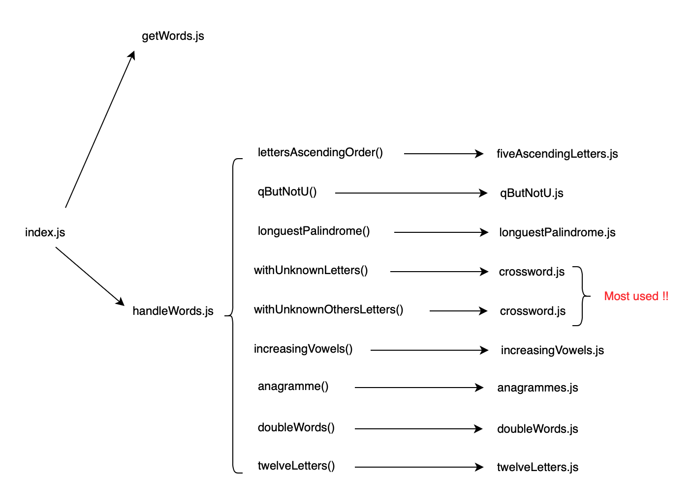

# play-with-words :feet: 

Models the functions of the helpers folder to play with words.  
See the result via the console.log of the browser called in the file handleWords.js
Schematization of the structure of the code:

